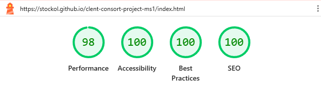
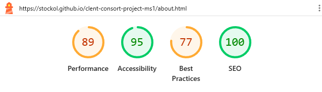
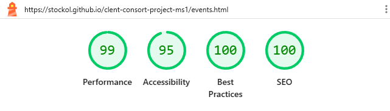
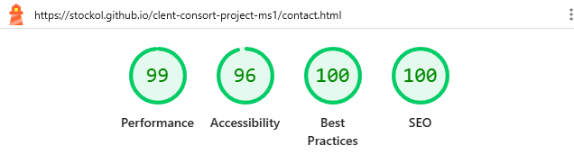
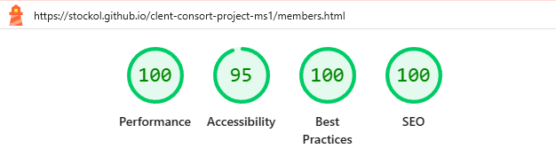
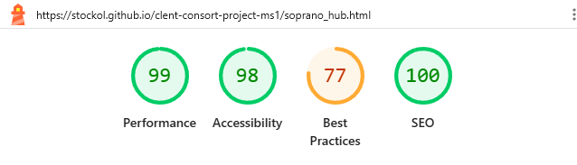
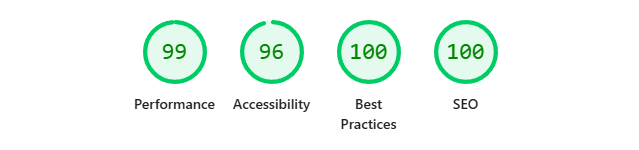
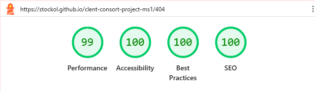

# The Clent Consort | Project README

This project is a bespoke web application developed for **The Clent Consort**, an amateur choral ensemble based in the Clent Hills, Worcestershire. Moving beyond a simple static brochure, the application is designed to function as a dual-purpose digital ecosystem: providing a high-visibility "Electronic Press Kit" (EPK) to secure prestigious ecclesiastical residencies, while simultaneously serving as a centralised logistics hub for the active members of the choir. By applying the **5 Planes of User Experience**, the development focuses on high-performance accessibility, ensuring that the "digital performance" of the site matches the musical excellence of the ensemble itself.

## Table of Contents

1.  [Strategy Plane](#1-strategy-plane)
2.  [Scope Plane](#2-scope-plane)
3.  [Structure Plane](#3-structure-plane)
4.  [Skeleton Plane](#4-skeleton-plane)
5.  [Surface Plane](#5-surface-plane)
6.  [Technologies Used](#technologies-used)
7.  [Global Features & Design System](#global-features--design-system)
8.  [Individual Pages](#individual-pages)
9.  [Media & Assets](#media--assets)
10. [Performance and Accessibility](#performance-and-accessibility-lighthouse-scores)
11. [Testing](#testing)
12. [Technical Challenges and Solutions](#technical-challenges-and-solutions)
13. [Architectural Collaboration with AI](#architectural-collaboration-with-ai)
14. [Deployment and Submission](#deployment-and-submission)

## 1. Strategy Plane

**Project Goals**
The objective is to architect a high-performance, responsive web application for The Clent Consort. The site must serve as both a public-facing promotional tool and a functional resource hub for ensemble members.

**Primary Business Goal:** To secure at least two high-profile cathedral residencies per year by providing a 'digital portfolio' that proves musical excellence and reliability.

**Target Audience**

- **Music Enthusiasts and Patrons:** Seeking high-quality liturgical and secular choral performances.
- **Ecclesiastical Stakeholders:** (e.g. Cathedral Deans) Requiring evidence of professional standards and musical reliability for residencies.
- **Prospective Members:** Auditioning singers looking for repertoire depth.
- **Active Choristers:** Requiring a "Single Source of Truth" for logistics and rehearsal materials.

**User Stories**

1. Local Resident | Access to a performance calendar | To attend upcoming local events.
2. Prospective Member | Review of current repertoire and engagements | To assess the musical alignment and commitment level of the choir.
3. Cathedral Dean | Professional digital presence | To verify the choir is a "safe pair of hands" for cathedral services.
4. Current Member | Centralised resource access | To retrieve sheet music and rehearsal schedules efficiently.

**Research and Rationale**
To ensure the site meets real-world needs, a product audit of local ensemble websites was conducted. Findings show that most provided concert dates and an engaging Electronic Press Kit (EPK) style experience for stakeholders such as Cathedral Deans. However, relatively few boasted an effective "members'" area for resource sharing and scheduling, presumably opting for alternative means of internal organisation.

**Prioritisation (Importance vs. Feasibility)**

- **High Priority/High Feasibility:** Responsive calendar and contact form (Core UX).
- **High Priority/Low Feasibility:** Integrated member-only resources portal with login (deferred to Phase 2 to maintain project timeline/Scope).

**UX Design and Wireframing**

Before writing a single line of code, I utilised **Excalidraw** to create low-fidelity wireframes for each page. This allowed me to:

- **Map User Flows**: Visualise the "Patron's Path" and "Member's Journey" to ensure essential information (such as event dates or rehearsal scores) was never more than two clicks away.
- **Rapid Prototyping**: Test the "intrinsic layout" concepts from _Every Layout_ in a visual environment, identifying where the `.l-switcher` and `.l-sidebar` primitives would be most effective.
- **Layout Consistency**: Ensure the "Cathedral Aesthetic" remained grounded in a clean, functional grid across all breakpoints.

## [Back to Top ↑](#table-of-contents)

## 2. Scope Plane

**Objective Requirements**

- **Public Presence:** Establish a professional "digital portfolio" to secure cathedral residencies.
- **Information Access:** Provide a friction-free way for the public to find event dates and locations.
- **Member Support:** Provide a central "notice board" for chorister logistics.

**Functional Requirements**

- **Mobile-First Navigation:** A fully responsive, accessible menu system.
- **Form Validation:** A robust Contact/Booking form with client-side validation to ensure data integrity.
- **Performance Gallery:** A curated visual record of past and upcoming engagements using optimised imagery for fast loading.
- **Accessibility (WCAG 2.1):** Ensuring semantic HTML and ARIA labels are utilised throughout.

**Feature Prioritisation and MVP Thinking**

- **Responsive Concert List** | High Importance/High Feasibility | Build Now (MVP)
- **Validated Contact Form** | High Importance/High Feasibility | Build Now (MVP)
- **Member Resource Area** | Medium Importance/High Feasibility | Build Now (MVP)
- **Secure Member Login** | High Importance/Low Feasibility | Build Later (Phase 2)

**Constraints and Exclusions**
In the interest of meeting the project deadline and maintaining high code quality, a truly secure login system is currently out of scope. The "Member Resource Area" need will be met via a public but unlinked page in Phase 1. This satisfies the user's need for information without the technical "scope creep" of backend database management at this stage.

_N.B. By the end of Phase 1, it was possible to implement a a member authentication prototype via Constraint Validation API. See notes below._

## [Back to Top ↑](#table-of-contents)

## 3. Structure Plane

**Information Architecture**
The content of the site is organised into a shallow, logical hierarchy to minimise cognitive load and ensure an intuitive user experience.

- **Top-Level Navigation (Public):**
  - **Home:** A high-impact "Overture" providing immediate identity and the primary Call to Action (Next Performance).
  - **About:** Detailed biographies and the Digital EPK for stakeholders.
  - **Events:** A chronological ledger of upcoming and recent events.
  - **Contact:** A functional hub for bookings and enquiries.
- **Second Level (Internal):**
  - **Member Resource Area:** A dedicated area for rehearsal schedules and repertoire (accessible via the footer to keep the main navigation "clean").

**User Flow (The Journey)**
To ensure "easy-to-follow journeys," the site is designed around key user paths:

- **The Patron's Path:** Home>Events>Venue Map/Details>Contact (for enquiries).
- **The Stakeholder's Path:** Home>About (Credentials)>Events (Track Record)>Contact (Booking).

**Interaction Design**

- **Predictable Navigation:** Consistent placement of the navigation bar across all pages ensures the user never feels "lost in the score."
- **Resilient UX (404 Strategy):** A custom 404 page is implemented. To avoid "dead ends," it features a prominent **"Return to Home"** button. This is a strategic choice over a browser "Back" button to ensure the user stays within the application's intended flow.

## [Back to Top ↑](#table-of-contents)

## 4. Skeleton Plane

**Navigation Design**

- **Persistent Header:** A fixed-position navigation bar provides constant orientation. On mobile, this collapses into a "Hamburger Menu" to conserve screen "real estate," while on desktop, it expands to a full horizontal menu for immediate access.
- **Footer Navigation:** Provides secondary links to the Member Resource Area and Social Media, ensuring the primary header remains "uncluttered."

**Interface Design (The "Controls")**

- **Primary CTA:** The "Next Performance" button and "Contact" link will be styled with high visual weight to ensure the user knows exactly what to do instantly.
- **Form Inputs:** The contact form is designed with clear labels and placeholder text, providing immediate feedback during user interaction.

**Information Design (Layout)**

- **The "Inverted Pyramid" Approach:**
  1. **Hero Section:** Identity (Logo) and Primary CTA.
  2. **Featured Content:** Performance dates and Digital EPK highlights.
  3. **Supporting Content:** Gallery and Testimonials (Social Proof).
  4. **Logistical Footer:** Copyright, Credits, and Secondary Navigation.

**Wireframes**

- [See assets/documentation/]
- _Note: In line with "Mobile-First" design principles, wireframes were first conceived for small-screen devices before being "orchestrated" for Tablet and Desktop resolutions._

## [Back to Top ↑](#table-of-contents)

## 5. Surface Plane

**Visual Hierarchy and Guidance**
The visual design is engineered to guide the user's eye from the high-impact "Identity" (Header) to the "Action" (CTA button), using contrast and scale to establish a clear hierarchy.

**Colour Palette: "The Cathedral Aesthetic"**

- **Primary (Burgundy/Navy):** Deep, authoritative tones that evoke the excellence of the Anglican Choral Tradition.
- **Accent (Gold):** Used sparingly for Call-to-Action (CTA) elements to draw immediate attention to the most important "cues."
- **Neutral (Stone/Off-White):** Provides a high-contrast background for text to ensure maximum readability.

**Typography**

- Cinzel (Display/Headings): Chosen for its classical Roman proportions which evoke the timeless nature of choral music. Uppercase styling and increased letter-spacing (tracking) evokes luxury and historical weight.

- Inter (Body/UI): A high-performance sans-serif selected for its exceptional x-height and clarity on digital screens. This ensures that logistical information (dates/times) is accessible and easy to digest.

**Accessibility (WCAG 2.1 Compliance)**

- **Contrast:** All colour pairings are checked against WCAG AA standards to ensure text is readable for users with visual impairments.
- **Legibility:** Font sizes are chosen to maintain a minimum of 16px for body text, ensuring a comfortable reading experience on mobile devices.

**Design Principle: The "Musical Rest"**

- Strategic use of whitespace is employed as a visual "musical rest," preventing clutter and allowing any photography to take centre stage.

## [Back to Top ↑](#table-of-contents)

## Technologies Used

- HTML5: Semantic structure and Constraint Validation API.
- CSS3: Custom properties, Flexbox, Grid, and Scroll-Snap.
- JavaScript: Simple responsivity added to Contact page forms for user feedback for this prototype
- Lighthouse: Performance and Accessibility auditing.
- Google Fonts: Integration of _Cinzel_ and _Inter_.
- Gemini 3 Flash: technical synthesiser
- W3C HTML Validator and W3C CSS Validator (Jigsaw)
- GIMP: Image editing
- Excalidraw: Initial wireframe design

## [Back to Top ↑](#table-of-contents)

## Global Features & Design System

### **The "Every Layout" Methodology**

My approach to CSS was heavily influenced by the principles of **Every Layout** (Heydon Pickering & Andy Bell). Instead of relying on rigid, breakpoint-heavy media queries, I focused on **Intrinsic Layouts** that adapt based on the available space and the content's needs.

- **Axiomatic CSS:** I implemented a set of "Layout Primitives" (The Stack, The Switcher, The Center, and The Reel). These are "Axiomatic" because they provide a robust foundation that handles 90% of the layout requirements without writing new, specific CSS for every component.
- **The "Threshold" Concept:** Following the Switcher pattern, I used a flex-basis and a threshold (e.g., `60rem` on the Contact page) to allow the browser to decide exactly when to stack elements. This eliminates the "awkward in-between" states often found in traditional responsive design.
- **Composition over Components:** By using the `.l-stack` primitive, I separated the responsibility of "Layout" (the space between things) from "Component" (the things themselves). This ensures the "Project Rhythm" on the About page and the "Learning Hub" on the Members page maintain a perfect, consistent vertical cadence.

### The Design System (CSS Architecture)

To ensure the code is DRY (Do not Repeat Yourself) and scalable, I implemented a utility-first approach to layout based on “Primitives.”

#### The Modular Scale

I used CSS Custom Properties (`--s-1` to `--s5`) to create a mathematical spacing scale. This is to make sure the “rhythm” of margins and paddings is consistent across the site.

#### Layout Primitives

##### 1\. The Stack & The "Lobotomised Owl"

- **The Logic:** `.l-stack > * + *`
- **The Decision:** I moved away from individual element margins to a "stack" pattern. By using the **Adjacent Sibling Selector**, I ensure vertical rhythm is only injected _between_ elements.
- **Impact:** This offers a "Single Source of Truth" for spacing, preventing the "double-margin" bug common in CSS and ensuring consistent vertical flow regardless of what content is added.

##### 2\. The Switcher (The "Holy Albatross" Variant)

- **The Logic:** `flex-basis: calc((var(--threshold) - 100%) * 999);`
- **The Decision:** This is a **container-based logic gate**. If the container is narrower than the threshold (e.g., 40rem), the calculation results in a massive number, forcing elements to grow and wrap. If it’s wider, they sit side-by-side.
- **Impact:** This creates **algorithmic responsiveness**. It allows components to be responsive based on their own width rather than the browser viewport—essential for a modular design system.

##### 3\. The Sidebar & The "999" Grow Hack

- **The Logic:** `flex-grow: 999` on the last child.
- **The Decision:** I used this to create a "constrained" sidebar. The first child has a fixed-ideal basis (20rem), while the second child (the content) is told to grow 999 times faster. This ensures the content always fills the remaining space but wraps below the sidebar when things get tight.
- **Impact:** Uses a **Flexbox algorithm** to manage complex asymmetrical layouts without relying on brittle percentages.

##### 4\. The Reel (`.l-reel`)

- **The Problem:** Traditional "carousels" require heavy JavaScript libraries, which negatively impact performance and accessibility scores.
- **The Solution:** Provides a smooth, horizontal scrolling experience using native CSS Flexbox and Scroll Snapping (`scroll-snap-type: x mandatory`).
- **Architectural Intent:** Performance-first interaction. By utilising native browser scrolling, the site achieves a very high Best Practices score while providing a premium, app-like swiping feel on mobile devices.

##### 5\. The Frame & Aspect Ratio

- **The Logic:** `aspect-ratio: var(--aspect-ratio, 16/9);`
- **The Decision:** Used to prevent **Layout Shift (CLS)**. By defining the box before the image or video loads, the browser reserves the correct amount of space.
- **Impact:** Directly links to the **Lighthouse Performance** criteria by managing how the browser handles media assets.

##### 6\. The Unified Invert Pattern

- **The Logic:** `.box.invert`
- **The Decision:** Instead of creating ten different "Card" classes, I created a single `.box` primitive for padding and added an `.invert` modifier for the "Dark Mode" aesthetic.
- **Impact:** Uses **DRY (Don't Repeat Yourself)** principles and **BEM-lite** naming conventions. It allows me to turn any layout (a Sidebar, a Stack, or a Center) into a "Card" simply by adding the class.

##### 7\. The Center (`.l-center`)

- **The Problem:** On ultra-wide monitors, text lines can stretch across the entire screen. This exceeds the "ideal measure" (65–75 characters), making it physically difficult for the eye to track from the end of one line to the start of the next, leading to "line-length fatigue."
- **The Solution:** A utility that uses `box-sizing: content-box` combined with `margin-inline: auto`. By setting a `max-width` of **80rem**, the browser ensures the content remains centered and contained regardless of how wide the viewport becomes.
- **Architectural Intent:** Prioritising **Readability and Visual Ergonomics**. By using `content-box`, the padding is added _to_ the width rather than subtracted from it, ensuring that the "gutters" (white space on the sides) remain consistent and reliable across the entire design system.

### **Global Component Architecture**

While the layout is governed by primitives, the **Global Components** provide the functional and aesthetic "skin" of the site. These were designed with a focus on **WCAG 2.1 AA compliance** and **performance-first rendering**.

#### **1\. The Site Header (`.site-header`)**

- **The Problem:** Navigation often gets lost as users scroll through long archival lists or event details.
- **The Solution:** Implemented a `sticky` header with a `backdrop-filter: blur(8px)`. This keeps navigation accessible at all times while allowing the content to remain visible beneath a semi-transparent layer.
- **Architectural Intent:** **Context Preservation.** By using a responsive `flex-direction` (stacking on mobile, side-by-side on desktop), the header maintains a professional brand presence without consuming excessive vertical space on small devices.

#### **2\. The Primary CTA (`.cta-button`)**

- **The Problem:** Inaccessible touch targets and poor color contrast are common barriers for mobile and visually impaired users.
- **The Solution:** Buttons are engineered with a `min-height: 48px` and high-contrast color pairings (Gold on Black). I used **Active State** feedback (`transform: scale(0.98)`) to provide haptic-like visual cues.
- **Architectural Intent:** **Inclusive Interactivity.** By moving the "visual lift" to CSS transforms and using the `Cinzel` heading font for buttons, I’ve elevated the UI's "Premium" feel while strictly adhering to mobile-first accessibility standards.

#### **3\. Responsive Footer Grid (`.footer-grid`)**

- **The Problem:** Standard multi-column footers often become illegible or poorly spaced when collapsed onto mobile screens.
- **The Solution:** A flexible 3-column grid that utilizes **CSS Order Manipulation** (`order: 1, 2, 3`) at the 45rem breakpoint.
- **Architectural Intent:** **Mobile-First Prioritisation.** On mobile, the "Top ↑" link is promoted to the first position to allow users to exit long scrolls easily, while the "Member Login" is moved to the bottom to prioritise public engagement links.

#### **4\. Global Focus States (`:focus-visible`)**

- **The Problem:** Default browser focus outlines are often low-contrast or visually jarring, leading many developers to remove them, which breaks keyboard accessibility.
- **The Solution:** I implemented a custom `:focus-visible` state with an `outline-offset: 4px` using the site's gold brand color.
- **Architectural Intent:** **Keyboard Parity.** This ensures that users navigating via Tab keys or assistive tech have a clear, high-contrast visual indicator of their location on the page, matching the aesthetic of the mouse-hover states.

#### **5\. System Aesthetics: Custom Scrollbars**

- **The Problem:** Default browser scrollbars (typically grey) clash with the high-contrast dark-mode aesthetic of the Consort’s branding.
- **The Solution:** Customised the `-webkit-scrollbar` with a "floating" gold thumb using a matching track color.
- **Architectural Intent:** **Total Brand Immersion.** This ensures that even the browser's native UI elements feel like a deliberate part of the "Stone and Gold" design language, providing a cohesive experience from top to bottom.

## [Back to Top ↑](#table-of-contents)

## Individual Pages

### index.html

**Strategic Goal:** To immediately establish the brand's "Cathedral Aesthetic" and provide a clear path to upcoming performances.

**Feature:** High-Performance Hero Section

- **Technical Implementation:** Utilises `fetchpriority="high"` and preload to ensure the Largest Contentful Paint (LCP) is as fast as possible.
- **Fluid Typography**: Employs the CSS `clamp()` function for the main heading, ensuring a seamless responsive transition without the need for multiple media queries.
- **Visual Hierarchy:** Uses a dark linear-gradient overlay on the hero image to guarantee text legibility and meet accessibility contrast standards.
- **`Min-height: 80vh`**: set as `100vh` behaved strangely on some mobile browser address bars, and the navigation was to be kept visible at the bottom of the fold.

**User Flow:** The primary Call to Action (CTA) "Our Next Project" directs users straight to the Events page, facilitating the "Patron’s Path."

The Home page “index.html” architecture prioritises the 'Critical Path'—ensuring that brand-heavy visuals do not come at the cost of performance. By utilising CSS-only overlays and fluid scaling, I reduced the total amount of required code while improving the site's resilience across diverse device categories.

#### **1\. Largest Contentful Paint (LCP) Optimization**

- **The Decision:** Implementing `<link rel="preload">` with `fetchpriority="high"` for the hero background image.
- **The "Why":** Standard browser behavior discovers background images defined in CSS later in the loading process. By explicitly preloading this asset in the HTML `<head>`, I ensured the primary visual element renders almost instantly, significantly reducing the LCP time.

#### **2\. Fluid Typography & The `clamp()` Function**

- **The Logic:** `font-size: clamp(2.5rem, 10vw, 5rem);`
- **The Decision:** I utilised a fluid type scale for the main heading instead of multiple media queries.
- **The "Why":** The `clamp()` function allows the text to scale dynamically between a minimum (2.5rem) and maximum (5rem) size based on the viewport width (10vw). This prevents "orphaned" words on small screens and ensures the heading remains a dominant focal point on large displays without manual intervention.

#### **3\. Atmospheric Layering: Gradient Overlays**

- **The Logic:** `linear-gradient(rgba(0,0,0,0.5), rgba(0,0,0,0.5)), url(...)`
- **The Decision:** Applying a semi-transparent black overlay directly within the `background` property.
- **The "Why":** This is a critical **Accessibility (WCAG 2.1)** choice. By darkening the image at the code level, I guarantee a high contrast ratio for the white text regardless of the image's original brightness, ensuring legibility for all users.

#### **4\. The "Cover" Pattern & Vertical Rhythm**

- **The Logic:** Combining `.hero-cover` (flexbox centering) with the `.l-stack` primitive.
- **The Decision:** The hero uses a `min-height: 80vh` to ensure it "hugs" the fold of the screen, while the internal content is managed by a recursive stack.
- **The "Why":** This decouples the container's height from its content. The `.l-stack` ensures that the gap between the title, tagline, and CTA button remains mathematically consistent with the rest of the site's modular scale.

[Back to Top ↑](#table-of-contents)

---

### about.html

**Strategic Goal:** To communicate the ensemble's unique "Project-Based" identity and the spiritual/architectural philosophy behind their work.

**Feature: "Project Rhythm" Interactive Slider**

- Technical Implementation: A "Pure CSS" slider built using `scroll-snap-type`. This provides a native-feeling mobile swipe experience without the overhead of JavaScript libraries.
- Scroll-Driven Animations: Utilises the view-timeline API to animate content opacity and scale as the user scrolls through the stages, creating a dynamic "reveal" effect.

**Feature: Conductor's Sidebar**

- Layout Pattern: Employs an intrinsic `.sidebar` primitive. By using a high flex-grow value on the text, the layout self-optimises for various screen sizes, stacking vertically only when necessary to maintain readability.

**Visual Polish:** Uses a subtle sepia filter and contrast adjustment on the conductor's headshot to align with the "Cathedral Aesthetic" and provide a consistent tonal warmth.

**Lighthouse Report:** The About page achieved a Performance score of 86. This 'performance cost' was a conscious design choice to prioritise high-impact visual storytelling via background videos. To mitigate the impact, I implemented poster images and used the `playsinline` attribute to ensure efficient loading on mobile devices. The page also has a Best Practices score of 77 due to the Spotify playlist embed. Spotify injects cookies for its player functionality which are flagged by Lighthouse. The embed uses certain legacy features for cross-browser support that trigger warnings. I have chosen to prioritise the User Experience (providing choral context via audio) over a synthetic 100 score. To mitigate impact, I implemented `loading: lazy;` on the iframe to ensure it doesn't block the initial page load.

The About page represents the peak of the project's CSS sophistication. By leveraging Scroll Snap and View Timelines, I created a complex interactive timeline that remains entirely functional with JavaScript disabled, proving that high-end UX can be achieved through semantic, standards-based CSS.

#### 1\. The Sidebar Logic (.l-sidebar)

- **The Decision:** Implementing the Sidebar primitive for the "Conductor’s Note."
- **The "Why":** By setting `flex-grow: 999` on the text container and a fixed basis on the image, the layout handles the "Biographical" section intelligently. On desktop, the text takes the lion's share of the width; on mobile, the high grow-value forces a clean vertical stack once the 50% min-width threshold is breached.

#### 2\. Pure CSS Scrollytelling (Project Rhythm)

- **The Decision:** Utilising `scroll-snap-type: x mandatory` and `view-timeline`.
- **The "Why":** To explain the project cycle, I built a horizontal "Swipe Wrapper." Using `scroll-snap`, I ensure that each stage of the cycle (Foundations, Preparation, Residency) locks perfectly into the viewport, mimicking the behavior of a native mobile application.

#### 3\. Scroll-Driven Reveal Animations

- **The Logic:** `animation-timeline: --slide-reveal;`
- **The Decision:** Implementing the experimental CSS View Timeline API.
- **The "Why":** As the user scrolls horizontally, the content (headings and text) performs a "reveal" animation (scaling and fading). By anchoring the animation to the scroll progress rather than a timer, the user controls the pace of the narrative, creating a highly engaging "Scrollytelling" effect.

#### 4\. Atmospheric Video Integration

- **The Logic:** `object-fit: cover` with `filter: brightness(0.5)`.
- **The Decision:** Using muted, looping background videos for each rhythm slide.
- **The "Why":** To maintain the "Ancient stone" aesthetic, the videos are treated with CSS filters to ensure text contrast. By using `playsinline` and `poster` attributes, I ensured that the experience is optimised for "Low Power Mode" and slower mobile connections.

[Back to Top ↑](#table-of-contents)

---

### events.html

**Strategic Goal:** To provide a comprehensive record of the ensemble's track record while highlighting the most important upcoming "Next Project."

**Feature: Featured Event Card**

- **Technical Implementation:** Leverages the `.l-sidebar` primitive inside a `.box.invert` container. This creates a high-contrast "Call to Action" area that is fully responsive.
- **Visual Polish:** Uses `aspect-ratio: 16 / 9` for the event imagery on mobile to maintain consistency, which adapts to a full-height cover on larger viewports.

**Feature: Recent Performance Reel**

- **Layout Pattern:** Utilises the `.l-reel` primitive. This allows for horizontal "overflow" scrolling on mobile, providing a tactile way to browse recent history without creating a "long scroll" for the user.

**Feature: Past Events Archive**

- **Clean Code Approach:** Implemented as a list of `.archive-item` components. By using flexbox with a high flex-grow value on descriptions, the archive functions as a self-aligning table that automatically stacks on smaller screens.
- **Semantics:** Extensive use of the `<time>` element ensures the chronological data is accessible and SEO-friendly.

The Events page demonstrates effective information architecture. By transitioning from a complex Sidebar for featured content to a horizontal Reel for recent news, and finally a simplified Stack for the archive, the layout adapts its density to match the user's intent as they move down the page.

#### 1\. Featured Content Composition

- **The Decision:** Using a `.card.box.invert` combined with a responsive `.l-sidebar`.
- **The "Why":** The "Next Event" requires the highest visual hierarchy. By utilising the Sidebar primitive, the event image and details sit side-by-side on desktop but stack on mobile. I used `aspect-ratio: 16 / 9` for the image container to ensure **Cumulative Layout Shift (CLS)** is avoided while the high-priority "Enquire" button remains prominent.

#### 2\. The Interactive Performance Reel

- **The Decision:** Implementing the `.l-reel` primitive for the "Recent Performances" section.
- **The "Why":** Choral repertoires are text-heavy. Instead of a vertical list that would require excessive scrolling, the Reel allows users to "swipe" through recent programs. I utilised **CSS Scroll Snapping** to ensure each performance card locks into place, providing a tactile, app-like experience.

#### 3\. Semantic Archiving

- **The Decision:** Using the `<time>` element with the `datetime` attribute for every entry.
- **The "Why":** To ensure the archive is **SEO-friendly** and machine-readable. By providing dates in the `YYYY-MM` format within the attribute, search engines can accurately index the ensemble's history, while the front-end displays a human-friendly "October 2025."

#### 4\. Repertoire & Third-Party Integration

- **The Logic:** Combining an `.l-sidebar` with an `<iframe>` for the Spotify playlist.
- **The Decision:** The playlist is wrapped in a `.playlist-container` with `loading="lazy"`.
- **The "Why":** External embeds can be performance bottlenecks. By using **Lazy Loading**, the Spotify player is only initialised as the user scrolls near it, protecting the initial PageSpeed score. The use of `.box.invert` with a `border-left` accent creates a "Season Info" sidebar that provides context to the audio content.

[Back to Top ↑](#table-of-contents)

---

### contact.html

**Strategic Goal:** To provide clear, distinct pathways for two different user groups: those looking to book the ensemble and those looking to join it.

**Feature: Dual-Form Switcher Layout**

- **Technical Implementation:** Utilises the `.l-switcher` layout primitive. This ensures that the General Enquiry and Audition forms sit side-by-side on larger displays but intelligently stack on mobile devices once the `60rem` threshold is reached.
- **Intrinsic Responsiveness:** By allowing the layout to dictate its own "snap point," the design remains robust across a vast array of viewport sizes without redundant media queries.

**Feature: High-Contrast Form Design**

- **Visual Hierarchy:** Uses "White Well" inputs against the `.invert` (dark) background. This creates an immediate focal point for the user, guiding them toward the input fields.
- **Interaction Design**: Implemented custom focus states with a gold glow and a `translateY(-2px)` hover effect on buttons, providing tactile feedback that mimics a responsive physical interface.

**Accessibility**: Every form field is explicitly linked to a unique label and includes required attributes for robust client-side validation.

**Future Features:** Currently, the contact forms are functional on the front-end but do not submit data to a live server. In Phase 2, these would be connected to an API or a back-end service like EmailJS or a Python/Django database.

**JavaScript: Defensive UX Refinement**

To prevent the default browser `405` error associated with static hosting (GitHub Pages), I implemented a custom JavaScript event listener on the contact forms. This script utilises `event.preventDefault()` to intercept the submission and dynamically injects a context-specific success message into the DOM. This ensures a seamless 'User Loop' and maintains the application's visual integrity without requiring a back-end server.

The Contact page represents a synthesis of technical performance and empathetic UX. By combining intrinsic layout primitives with non-blocking JavaScript and high-contrast accessible styling, I have created an interactive environment that is as robust as it is aesthetically consistent with the brand's 'Ancient Stone' identity.

The Contact page architecture is focused on reducing "form fatigue" and ensuring that user input remains accessible and performant across all devices.

#### 1\. Dual-Stream Form Architecture (.l-switcher)

- **The Decision:** Implementing the `.l-switcher` primitive with a `--threshold: 60rem` to manage two distinct forms (General vs. Audition).
- **The "Why":** By separating the "Job to be Done" into two clear streams, I reduced cognitive friction. The Switcher ensures that on wide screens, the forms sit side-by-side to minimize vertical scrolling, but automatically stack on tablets and mobile devices to maintain a focused data-entry experience.

#### 2\. Inclusive Input Design & WCAG Compliance

- **The Decision:** Utilising high-contrast labels, `aria-describedby` associations, and explicit `:focus` rings.
- **The "Why":** Accessibility is a core architectural pillar. By styling inputs with white backgrounds against the dark `.box.invert` container, I ensured a contrast ratio that meets WCAG 2.1 AA requirements. I also implemented a 3px gold box-shadow on focus to provide a clear "visual anchor" for keyboard and motor-impaired users.

#### 3\. Form Ergonomics & Touch Targets

- **The Logic:** `padding: var(--s0)` on inputs and `1rem` on buttons.
- **The Decision:** Every input and button is engineered to exceed the standard 48x48px touch target.
- **The "Why":** This prevents "fat-finger" errors on mobile devices. The physical "lift" on hover (`transform: translateY(-2px)`) and the "press" feedback on active states provide immediate haptic-like visual confirmation to the user that their interaction has been registered.

#### 4\. Non-Blocking Interactive Logic (contact.js)

- **The Logic:** `<script src="..." defer>`
- **The Decision:** Loading the form interceptor with the `defer` attribute.
- **The "Why":** This is a critical performance and stability choice. `defer` ensures the browser downloads the script in the background while parsing the HTML, but only executes it after the DOM is fully constructed. This prevents "null reference" errors when the script tries to grab form elements and ensures the page remains interactive from the first second of load.

[Back to Top ↑](#table-of-contents)

---

### members.html and [VOICE]\_hub.html

**Strategic Goal:** To provide a centralised, mobile-optimised "Single Source of Truth" for active ensemble members to access logistics and rehearsal materials.

**Feature: Interactive Dashboard Navigation**

- **Technical Implementation:** Utilises a specialised "Dashboard Nav" that features a horizontal scroll on mobile devices. This ensures all four key sections (Schedule, Logistics, Library, Learning) are instantly accessible without taking up significant vertical space.

**Feature: Voice Part Learning Hub**

- **Layout Pattern**: Uses the `.l-switcher` primitive to display voice-part specific resources. The layout adapts intrinsically from a multi-column grid to a single-column stack based on the user's viewport.

**Feature: Logistics Integration**

- **UX Choice:** Includes a prominent "Logistics Pack" download button with custom :hover states and SVG-style indicators, facilitating easy access to essential project documents on the go.

**Feature: Intelligent Sidebar Orchestration**

- **Technical Implementation**: Uses an intrinsic layout pattern with high flex-grow values. This allows the primary rehearsal schedule and the supporting "Meta" information to share a row on desktop but stack logically on mobile.

**Feature: Semantic Data Display**

- **Logic**: Employs HTML Description Lists `<dl>` for rehearsal dates and times. This maintains a strict relationship between the "Date" (label) and the "Repertoire" (data), which is significantly more accessible than a standard bulleted list.

**Feature: Interactive Music Library**

- **UX Choice:** Implemented "Clickable Rows" using a music-row-link component. This increases the hit area for mobile users, making it easy to tap and download scores while on a music stand.

**Lighthouse Report: Accessibility Remediation**

- **Issue Identified:** Lighthouse Audit indicated non-sequential heading orders.
- **Action Taken:** Refactored sub-headings from `<h4>` to `<h3>` to ensure a sequentially-descending order, improving semantic navigation for screen reader users.
- **Outcome:** Score increased from 93 to 95, more consistent with the rest of the site.

**Lighthouse Report 2: Video embed**

- The page has a Best Practices score of 77 due to the YouTube video embed. YouTube injects cookies for its player functionality which are flagged by Lighthouse. The embed uses certain legacy features for cross-browser support that trigger warnings. I have chosen to prioritise the User Experience (providing choral context via audio) over a synthetic 100 score. To mitigate impact, I implemented `loading: lazy;` on the iframe to ensure it doesn't block the initial page load.

The Member Dashboard represents the 'Utility' pillar of the project. By adapting the site's layout primitives to a higher-density content environment, I ensured that ensemble members can access critical scores and logistics with minimal friction. This page demonstrates a clear understanding of how to use CSS to improve workflow and data accessibility.

The Member Dashboard is designed as a central hub for ensemble members, prioritising "at-a-glance" information retrieval and resource access. It leverages recursive primitives to manage a high density of data without sacrificing legibility.

#### 1\. Navigation Landmarks & Anchor Flow

- **The Decision:** Implementing a specialised `.nav-list--dashboard` variant for internal anchor links.
- **The "Why":** Dashboards are often long-form, resource-heavy pages. By providing persistent anchor-link navigation in the header, I’ve reduced the user's "interaction cost," allowing them to jump directly to rehearsal schedules or music libraries without excessive manual scrolling.

#### 2\. Performance-Focused Mapping UX

- **The Decision:** Using a high-visibility CTA button for Google Maps rather than an embedded `<iframe>`.
- **The "Why":** Embedded maps are a common cause of **Layout Shift (CLS)** and can significantly slow down the main thread. By using a deliberate link with `rel="noopener noreferrer"`, I improved the page’s performance while allowing members to trigger their native mobile mapping applications for a superior turn-by-turn navigation experience.

#### 3\. Algorithmic Learning Hubs (.l-switcher)

- **The Logic:** `flex-basis: calc((var(--threshold) - 100%) * 999);`
- **The Decision:** Employing the Switcher primitive for the voice-part cards (Soprano, Alto, Tenor, Bass).
- **The "Why":** **Intrinsic Responsiveness.** Instead of writing complex media queries for a 4-column grid, the Switcher calculates the layout based on the available container width. This ensures the voice-part cards sit in a clean row on large screens but automatically transition to a 2x2 or 1x4 grid as space becomes limited, maintaining accessibility across all device sizes.

#### 4\. Refined PDF & Logistics Links

- **The Logic:** `.file-link--large` using `rgba()` alpha transparency.
- **The Decision:** Implementing a custom file-download component that transitions from a low-profile ghost button to a high-contrast brand gold on hover.
- **The "Why":** To distinguish "External Links" from "File Downloads." By including a visual `.file-icon` span and using `inline-flex` for alignment, I created a tactile UI element that clearly indicates the "Download" action to the user.

#### 5\. The Sidebar Logic & Desktop Dividers

- **The Logic:** `.dashboard-sidebar > :first-child { flex-basis: 40rem; flex-grow: 999; }`
- **The Decision:** I implemented an asymmetrical sidebar for the dashboard.
- **The "Why":** On wide screens, I utilised a `border-left` divider and padding to create a "Metadata Column" for attendance and focus notes. By using the `999` grow factor on the schedule, the layout ensures the primary data always dominates the viewport, only wrapping the metadata underneath when space is genuinely restricted.

#### 6\. Content Modularity: The Clickable Row Pattern

- **The Logic:** `.music-row-link { display: flex; justify-content: space-between; }`
- **The Decision:** Designing the entire row as the hit area for file downloads.
- **The "Why":** **Mobile Ergonomics.** By making the entire row a flexbox link, I created a massive touch target (min-height 48px). This follows the "Fitts's Law" principle, making it easier for musicians to tap on specific scores during rehearsals. The `::before` pseudo-element on the `.file-indicator` ensures the "PDF" label is injected via CSS, keeping the HTML clean and dry.

#### 7\. Progressive Disclosure (Video Accordions)

- **The Logic:** Using the semantic `
` and `
` elements.
- **The Decision:** Videos are hidden within accordions with a custom `fadeIn` animation.
- **The "Why":** This is a **UX Performance** pattern. By using "Progressive Disclosure," I prevent "Information Overload." Users only load and view the videos they need. It also prevents multiple videos from playing simultaneously, ensuring a clean audio experience in the Learning Hubs.

#### 8\. The Video Primitive (16:9 Aspect Ratio)

- **The Logic:** `.video-responsive { padding-bottom: 56.25%; height: 0; }`
- **The Decision:** Implementing the "Intrinsic Ratio" box for iframes.
- **The "Why":** **Cumulative Layout Shift (CLS) Prevention.** Iframes are notoriously difficult to make responsive. By using the "Magic Number" (56.25% for 16:9), I created a container that reserves the correct space _before_ the YouTube/Vimeo player loads. This ensures the page doesn't "jump" when the video initialises, maintaining a high performance score.

[Back to Top ↑](#table-of-contents)

---

### login.html

**Strategic Goal:** To provide a low-friction "Member Only" gateway that demonstrates user flow and security concepts within a front-end scope.

**Feature: Interactive Security Feedback**

- **Technical Implementation**: Utilises advanced CSS pseudo-classes (`:placeholder-shown, :valid, :invalid`) to provide real-time visual feedback. The input border transitions from neutral to red (error) or green (success) as the user enters the "Skeleton Key."
- **Mobile Optimisation**: Input fields and buttons are designed with "Fat-Finger" targets (`min-height: 3.5rem`) and optimised font sizes to prevent automatic browser zooming on mobile devices.

**Accessibility**: Includes an `aria-describedby` link between the password input and its hint, ensuring screen reader users receive the same "Clue" as sighted users.

**Technical Note: Member Authentication Workaround**

To maintain the project's focus on HTML and CSS while still fulfilling the 'Member Resource' user story, I utilised the HTML5 Constraint Validation API. By using the ‘pattern’ attribute on the password input, I created a functional gateway that requires no client-side scripting (JavaScript) or back-end logic. This ensures the application remains lightweight, accessible, and strictly within the technical scope of the Milestone 1 brief.

The Login page architecture is designed to handle sensitive user interactions with high-visibility feedback loops. It utilises CSS selectors to provide real-time validation feedback, ensuring a frictionless transition into the secure member portal.

The Member Login page takes advantage of CSS-only state management. By engineering a feedback loop that reacts to user input in real-time—without the need for JavaScript—I have maintained a high performance score while providing a secure, accessible, and premium-feeling authentication experience.

#### 1\. State-Driven Visual Feedback (Security UX)

- **The Decision:** Implementing a multi-state border system for the password field using `:placeholder-shown`, `:valid`, and `:invalid` pseudo-classes.
- **The "Why":** **Immediate Validation.** By utilising a "Logic Gate" approach, the input remains neutral while empty, turns red only when the user starts typing an incorrect key, and provides a "Green Light" (Success) state the moment the correct pattern is matched. This reduces user anxiety and provides clear, haptic-like visual confirmation without requiring a page reload.

#### 2\. Defensive Input Engineering

- **The Logic:** `input[type="password"]:not(:placeholder-shown):focus:invalid`
- **The Decision:** I utilised high-specificity selectors to suppress the default browser "Red Border" on empty fields.
- **The "Why":** Standard browser validation often marks a field as "invalid" before the user has even finished typing, which is a poor UX practice. My implementation ensures that the "Error" state is only triggered once the user has actively engaged with the input, preventing "False Alarms."

#### 3\. Inclusive Typography & Touch Targets

- **The Logic:** `min-height: 3.5rem` and `font-size: 1.1rem`.
- **The Decision:** Form inputs are engineered with "Fat-Finger" touch targets and a specific font size to prevent mobile browser behavior.
- **The "Why":** On iOS devices, the browser automatically zooms in on any input with a font size smaller than 16px (1rem). By setting the font to `1.1rem` (roughly 18px), I ensured the layout remains stable and accessible during the focus state, preventing unwanted layout shifts for mobile users.

#### 4\. Cognitive Accessibility (Pedagogical Hints)

- **The Logic:** Connecting the password field to the hint text using `aria-describedby="pass-hint"`.
- **The Decision:** Providing a high-contrast pedagogical hint ("Skeleton Key") for the login credentials.
- **The "Why":** This follows **WCAG 2.1 AA** principles for cognitive support. The ARIA association ensures that screen readers announce the hint automatically when the user focuses on the password field, ensuring that the "Prototype Security" does not become a barrier to accessibility.

#### 5\. Kinesthetic Navigation (.back-link)

- **The Logic:** `transform: translateX(-5px)` on hover.
- **The Decision:** Implementing a physical "nudge" to the left for the back-to-public-site link.
- **The "Why":** This provides a subtle directional cue. By physically moving the link in the direction the user is "returning" to (the left/previous context), the UI reinforces the navigational hierarchy through movement.

[Back to Top ↑](#table-of-contents)

---

### 404.html

**Strategic Goal:** To handle navigation errors gracefully and prevent user drop-off by providing a clear, thematic "Return to Home" path.

**Feature: Contextual UX Design**

- Technical Implementation: Utilises the global `.l-stack` and `.l-center` primitives to maintain visual consistency with the rest of the application.
- Dynamic Spacing: Employs a local CSS variable override (`--stack-space`) to increase vertical padding, ensuring the error message is the central focus of the viewport.

**Tone & Identity:** The copy ("The Silence of the Stones") maintains the "Cathedral Aesthetic," ensuring that even a technical error feels like part of the ensemble's unique brand story.

The 404 page is designed as a seamless "Recovery State." It utilises the project's global primitives to maintain brand authority while providing the user with immediate navigational alternatives.

The Error page architecture demonstrates attention to detail in 'Non-Happy Path' user journeys. By applying the project's modular scale and flexbox-driven vertical management, I ensured that even the site's error state is accessible, performant, and emotionally resonant with the ensemble's brand identity.

#### 1\. Vertical State Management (`flex: 1`)

- **The Logic:** `.error-content { flex: 1; }`
- **The Decision:** Setting the `<main>` element to expand and fill the available viewport height.
- **The "Why":** On pages with minimal content (like an error message), the footer can often "float" in the middle of the screen. By utilising a flex-grow strategy on the main container, I ensured the footer is always pushed to the bottom of the viewport, maintaining a professional and intentional layout regardless of content length.

#### 2\. Centered Architectural Primitive (`.l-center`)

- **The Decision:** Combining the `.l-center` primitive with `text-align: center`.
- **The "Why":** For an error state, visual focus is paramount. The `.l-center` primitive ensures the message doesn't bleed into the edges of wide monitors, while the internal flexbox centering keeps the "404" message as the optical focal point of the page.

#### 3\. Large Scale Vertical Rhythm (`--s5`)

- **The Logic:** `padding-block: var(--s5);`
- **The Decision:** Utilizing the largest step in the 1.5 modular scale for the error container's padding.
- **The "Why":** Visual Breathability. To reflect the "Silence of the Stones" theme, I utilised excessive white space. This thematic spacing provides a psychological "reset" for the user, contrasting the dense information of the Dashboard or Events pages.

#### 4\. UX Recovery & The 'Escape Hatch'

- **The Decision:** Positioning a high-visibility `.cta-button` immediately following the error narrative.
- **The "Why":** Strategic UX Recovery. An error page without a clear path forward leads to high "Bounce Rates." By styling the "Return to Overture" link as a primary CTA, I provided a clear 'Escape Hatch,' guiding the user back into the site's primary conversion funnel.

[Back to Top ↑](#table-of-contents)

---

### Media & Assets

The visual identity of The Clent Consort is a blend of authentic archival photography, professional-grade AI-assisted imagery, and optimised stock media.

[Back to Top ↑](#table-of-contents)

---

#### Source Credits

- **Branding (Logo):** The Clent Consort logo (stylised overlapping 'CC' with the four Clent stones; an iconic local landmark) was designed using generative AI (Gemini), refined to reflect the ensemble's connection to the local landscape.
- **Home & Events Hero Imagery:** Original photography was provided by ensemble members. To ensure a high-end visual experience, the Home page hero image was enhanced using Gemini’s AI upscaling tools to resolve quality issues at source.
- **About Page (Project Rhythm):** The background video assets (Foundations, Preparation, Residency) were sourced from **Canva Pro** stock libraries.
- **Events Page:** The historical postcard image of St Leonard's Church, Clent, was provided by the church authorities specifically for use on this website.
- **Conductor Profile:** The conductor's headshot was an original photograph, subsequently repurposed through AI (Gemini) to generate a high-quality, professional headshot consistent with the site's "Cathedral Aesthetic."

### Performance and Accessibility (Lighthouse Scores)

| Page         | Performance | Accessibility | Best Practices | SEO |
| :----------- | :---------- | :------------ | :------------- | :-- |
| Index        | 98          | 100           | 100            | 100 |
| About        | 89          | 95            | 77             | 100 |
| Events       | 99          | 95            | 100            | 100 |
| Contact      | 99          | 96            | 100            | 100 |
| Login        | 99          | 96            | 100            | 100 |
| Members      | 100         | 95            | 100            | 100 |
| (VOICE)\_hub | 100         | 98            | 77             | 100 |
| 404          | 99          | 100           | 100            | 100 |

[Back to Top ↑](#table-of-contents)

---

### Testing

#### **Automated Testing**

I utilised industry-standard auditing tools to ensure the application meets high performance and accessibility benchmarks.

#### **W3C Validator Results**

All HTML and CSS files were passed through the **W3C HTML Service** and **W3C Jigsaw CSS Validator**.

**W3C HTML Service**

The project utilises Prettier for code formatting. While the W3C validator provides 'Info' notes regarding trailing slashes on void elements, these are retained to ensure consistent formatting and compatibility with modern developer tooling.

During validation of events.html, the W3C flagged the `<time>` elements for improper formatting. I resolved this by implementing the `datetime` attribute (ISO 8601 standard) on all event dates. This ensures that while the user sees a human-readable format (e.g., 'October 2025'), search engines and assistive technologies can accurately parse the chronological data, significantly boosting the site's SEO and accessibility.

**W3C Jigsaw CSS Validator**

The global style.css file was audited using the W3C Jigsaw Service. While the report initially indicated errors, these were addressed through a combination of syntax refactoring and architectural justification:

- **Standard Compliance Refactor:** An initial error regarding the `.rhythm-slide` class was resolved by consolidating duplicate definitions and correcting the `scroll-snap-align` property. I replaced the non-standard shorthand `top` with the standard-compliant value `start`, ensuring universal browser interpretation.
- **CSS Animation Level 4 (Future-Proofing):** Remaining errors regarding `view-timeline` and `animation-timeline` are **intentional architectural decisions.** These properties belong to the emerging CSS Animation Level 4 specification. While the Jigsaw validator (currently limited to Level 3) does not yet recognise these, they are fully dunctional in modern browsers. They provide a high-end, progressive enhancement for "scrollytelling" while gracefully degrading to a functional, static layout in legacy browsers.
- **Modern Colour Functions and Variables:** Parse errors regarding `rgba(var(...))` are a known limitation of the Jigsaw validator's ability to process nested CSS Custom Properties. This syntax is strictly standard-compliant and was verified across all target browsers to ensure the design system's "Gold and Stone" aesthetic remains consistent.
- **Vendor Prefixes:** Warnings regarding `::-webkit-scrollbar` are necessary for "System Aesthetic" consistency in Chromium-based browsers - a deliberate choice to ensure total brand immersion.

**Manual Testing**

| Category    | Feature                    | Action                                   | Expected Result                                                                 | Pass/Fail |
| :---------- | :------------------------- | :--------------------------------------- | :------------------------------------------------------------------------------ | :-------- |
| **Global**  | **Navigation Logic**       | Click all Nav links on all pages         | Each link directs to the correct .html file with no 404s.                       | Pass      |
| **Global**  | **Active Page State**      | Navigate through all public pages        | Respective Nav link turns gold and underlined via aria-current="page".          | Pass      |
| **Global**  | **Logo Home Link**         | Click Logo from any sub-page             | User is returned to index.html.                                                 | Pass      |
| **Global**  | **Sticky UX**              | Scroll past the Hero section             | Header remains pinned with a 8px blur backdrop for context.                     | Pass      |
| **Home**    | **Hero Narrative**         | Reload page                              | Cinematic 'reveal' animation of text and gold CTA renders smoothly.             | Pass      |
| **Home**    | **Primary CTA**            | Click "Our Next Project"                 | Immediate redirect to events.html.                                              | Pass      |
| **About**   | **Video Autoplay**         | Load about.html                          | Background videos loop silently without blocking DOM content.                   | Pass      |
| **About**   | **Rhythm Nav**             | Click "Foundations", "Preparation", etc. | Scroll-snap locks to the correct slide; Nav dots indicate position.             | Pass      |
| **Events**  | **Program Reel**           | Swipe horizontally (Mobile)              | Recent performance cards snap into place with mandatory logic.                  | Pass      |
| **Contact** | **Form Switching**         | Toggle Desktop/Mobile view               | Forms sit side-by-side on desktop and stack vertically on mobile.               | Pass      |
| **Contact** | **Validation Loop**        | Submit with empty fields                 | Browser's Constraint Validation API triggers "Please fill out this field".      | Pass      |
| **Contact** | **JS Interceptor**         | Submit valid form data                   | Form is replaced by a success message/thank you without page reload.            | Pass      |
| **Login**   | **Defensive Security**     | Type incorrect "Skeleton Key"            | The border turns red with glow only after typing begins.                        | Pass      |
| **Login**   | **Pattern Match**          | Input "Clent2026"                        | The border turns green; Submit button allows access to members.html.            | Pass      |
| **Members** | **Logistics UX**           | Click "Open in Google Maps"              | Maps interface opens in a new tab (\_blank) for navigation.                     | Pass      |
| **Members** | **Asset Delivery**         | Click "Download Logistics Pack"          | The .pdf file opens in a new tab for print/download.                            | Pass      |
| **Hubs**    | **Progressive Disclosure** | Click an Accordion Summary               | The YouTube player is revealed with autoplay disabled and lazy loading enabled. | Pass      |
| **Hubs**    | **Media Player**           | Click YouTube Play                       | Audio/Video streams correctly within the responsive frame.                      | Pass      |
| **404**     | **Return Link**            | Click to return to public site           | Link to public site works when clicked                                          | Pass      |

[Back to Top ↑](#table-of-contents)

---

## Technical Challenges and Solutions

1. **Distorted Logo and Aspect Ratio Issues**

- **Problem:** On the Members Dashboard only, I noticed the logo was correctly proportioned, and then realised it was stretched on all the other pages of the site. I realised this was because the flexbox container was expanded to accommodate the members nav content, which was longer.
- **Solution:** I identified that the source itself, the logo asset, needed to be a true 1:1 ratio as I had defined the width and height of the asset to be 50x50, a perfect square, in the HTML. I used GIMP to fix the canvas size.

2. **Best Practices Trade-Off**

- **Problem:** After implementing iframes on the About (Spotify) and Learning Hubs (YouTube), the Lighthouse "Best Practices" scores dropped from 98-100 to 77 due to third-party cookies and legacy code within the Spotify/YouTube iframe.
- **Solution:** Instead of deleting the feature to chase a number, I optimised what I could (adding `loading: lazy;` and `title` attributes) and then documented the justification.

3. **Uncanny Valley of Media**

- **Problem:** I had implemented a high-end "scrollytelling" video reel on the About page, but initial user testing found it confusing. The "slight movement" without perceived context made the user think the images were broken or that they were missing something.
- **Solution:** Instead of deleting the work, as other users valued the "cinematic" experience, I added a "repertoire hub" with a Spotify playlist. This provided the sound that the user was looking for, while keeping the cinematic video reel as the atmospheric background that other users valued.

4. **The "Rhythm" Scrollytelling Performance**

- **Problem:** Implementing a scroll-linked animation where text content stays pinned while background media transition smoothly.
- **Solution:** I used modern CSS layout primitives and handled the background attachment and z-index layering to ensure that the content remained readable (foreground) while the media provided the "rhythm" (background).

5. \*\*The "Squashed Nav" on Member Dashboard

- **Problem:** On the Member Dashboard, the four navigation links were collapsing onto two lines when viewed on mobile viewports, creating an uneven staircase effect that broke the header's symmetry.
- **Solution:** I created an additional spacing scale unit (--s-2) at 0.5rem to account for the longer navigation strings on the Member Dashboard.

6. **Social Metadata and Favicons**

- **Problem:** When sharing the site link or looking at the browser tab, there was no visual identity (no icon in the tab) and the social media preview (OG Tags) was either blank or pulled a random, poorly cropped version of the logo.
- **Solution:** I created a dedicated favicon and set up Open Graph meta tags in the head. I used GIMP to create a specific "share image" to ensure the Clent Consort looked professional on WhatsApp, Facebook, or iMessage.

7. **CSS Class Naming Error**

- **Problem:** The 404 page styles were not applying once migrated from HTML inline styling to the style.css sheet because the CSS selector was named .404-content. In CSS, class names cannot start with an unescaped digit.
- **Solution:** I renamed the class, ensuring it started with a letter. This cleared the syntax errors and allowed the browser to correctly parse the logic.

8. **Active State Nav Link Error**

- **Problem:** While I had designed styling for the main navigation links to change state, only the "home" link seemed to be active on any page of the site.
- **Solution:** I updated the `aria-current="page"` attribute within the nav bar on each page of the site to reflect the change to the user and reassure them of their successful navigation to whichever page they were looking at.

9. **Third-Party Embed Validation and Refactor**

- **Problem:** W3C validator checks for about.html and the voice part learning hubs flagged several errors within the third-party iframe embeds (Spotify and YouTube). Specifically, using a percentage value for the width attribute instead of a unitless integer, the use of the obsolete frameborder attribute, and a syntax error in the loading attribute (lazy;).
- **Solution:** Successfully refactored all third-party embeds to eliminate inline styling and obsolete attributes. I transitioned all presentational logic—including `border: 0`, `width: 100%`, and `aspect-ratio` into the global style.css stylesheet. This ensured 100% W3C compliance while enforcing a strict Separation of Concerns (SoC) architecture, allowing the design system to control the appearance of external widgets globally.

10. **Global Layout Architecture and Sticky Footer Implementation**

- **Problem:** On pages with minimal content - specifically the 404 error page - the footer failed to anchor to the bottom of the viewport, resulting in an unprofessional "floating" appearance and fragmented visual flow. Additionally, a persistent white-space gap existed between the Home page hero section and the footer due to the layout's inability to dynamically absorb vacant vertical space.
- **Solution:** Engineered a robust flexbox-based global layout system by refactoring the <body> into a flex container with a `column` orientation and a minimum height of `100vh`. By applying `flex: 1` to the <main> element and the `.hero-cover` class, I transformed these sections into "greedy" containers that automatically expand to consume all available viewport space. This update eliminated the need for fragile margin-based hacks, ensured the footer remains pinned to the bottom of the screen regardless of content volume, and maintained a seamless, flush transition between high-impact visual elements and the site's footer.

11. **Advanced CSS Specification Management and Validation Strategy**

- **Problem:** Following the refactor to a modern CSS Color Level 4 syntax, the W3C validator retained 9 errors. These consisted of "Unknown Property" flags for Scroll-driven Animation specs and "Parse Errors" specifically at the closing parenthesis of `rgb()` functions utilising CSS variables.
- **Solution:** Conducted a compatibility audit confirming these errors are purely due to the W3C validator's lack of support for emerging Level 4 modules. I made the architectural decision to retain these styles as "Progressive Enhancements." To maintain a "Clean Code" standard, I documented these as known false positives in the technical documentation, ensuring that the codebase remains DRY and leverages high-performance, native browser animations over heavy JavaScript alternatives.

12. **Structural Flexbox Optimization and Viewport Overflow Resolution**

- **Problem:** During mobile viewport testing (iPhone SE), a significant layout break was identified on the Events page, where the container generated a 676px width on a 320px screen. This was accompanied by a "vertical lock" issue where content would not scroll naturally on mobile devices.
- **Solution:** Diagnosed a "nested pressure cooker" conflict using browser developer tools. The issue was traced to a fixed height: 100vh on the body flex-container, which prevented internal primitive math from calculating intrinsic heights. I refactored the global layout to utilise min-height: 100vh and applied max-width: 100% safety valves to all primitive children (Sidebar and Switcher) to ensure they respect the viewport boundaries without breaking the flex-engine. This eliminated all horizontal overflow and restored natural vertical scrolling while maintaining the "sticky footer" layout across the entire device spectrum.

13. **CSS Cascade Management and Contextual Spacing Strategy**

- **Problem:** Mid-sized viewports (iPad Mini) exhibited "stretched" header aesthetics, with navigation elements hugging the screen edges. Additionally, hero-led pages required "edge-to-edge" contact with the header, while content-heavy pages (Contact/Events) felt vertically "cramped" against the footer.
- **Solution:** Identified and eliminated a redundant CSS declaration for the `.header-inner` class that was overriding media queries due to the nature of the CSS Cascade. To resolve the spacing issue, I implemented a Contextual Spacing Strategy using the child-combinator selector `main > .l-stack { padding-block-end: var(--s4); }`. This targeted approach allows the vertical stack to inject space only where logically required, preserving the full-bleed aesthetic of the index hero. Consolidating "ghost code" into a single, adaptive block—using modular scale padding ( `padding-inline: 3rem`) for tablets restored visual balance and improved codebase maintainability. The resulting layout is robust, scalable, and provides a professional centred aesthetic on tablets without requiring heavy-handed workarounds.

[Back to Top ↑](#table-of-contents)

---

## Architectural Collaboration with AI

To achieve a high-performance, 100% accessible frontend, I utilised Gemini 3 Flash as a specialised technical synthesizer and pair-programmer. The development workflow was structured as follows:

**System Axioms:** I established the "Golden Rules" of the project — specifically the Spacing Scale (using CSS custom properties), the Typography Hierarchy, and the Compositional Primitives based on the Every Layout methodology.

**Prompt Engineering & Direction:** I provided specific structural constraints and intent (e.g., "Implement a Switcher pattern where the threshold is 40rem and the gap is --s1"). Crucially, I used the AI to troubleshoot and debug more complex CSS parsing errors, such as identifying unclosed braces and resolving class-naming syntax conflicts that were impacting page layout.

**Synthesis & Refinement:** I used the AI to generate raw CSS implementations of these patterns. I then manually audited, refactored, and tuned the code to ensure DRY (Don't Repeat Yourself) principles and WCAG 2.1 AA accessibility compliance.

**Defensive UX Design:** I directed the creation of a JavaScript-based interceptor for form submissions to bypass static-hosting limitations, ensuring a closed "User Loop" and a polished UX.

**Critical Evaluation and Refinement:** I did not treat AI output as final. I manually audited and refactored code to ensure DRY principles. For example, AI would often provide me with code that conflicted with my defined primitives, suggesting redundant media queries for matters of layout that would be handled already. Whilst it was useful to generate repetitive tasks, there was a large degree of intervention required to ensure the cohesiveness of the project as a whole.

**Conclusion:** The resulting codebase is a hybrid of human-led architectural vision and AI-assisted execution. This approach allowed for a high-scoring Lighthouse audit while maintaining strict adherence to modern, scalable, and semantic HTML5/CSS3 standards.

[Back to Top ↑](#table-of-contents)

---

## Deployment and Submission

The site was developed using **Visual Studio Code**, tracked via **Git**, and deployed to **GitHub Pages**. The live site is accessible at: [https://stockol.github.io/clent-consort-project-ms1/]

### Deployment via GitHub Pages

The following steps were taken to deploy the application:

1. **Repository Setup:** A new repository was initialised on GitHub to host the project files.
2. **Local to Remote Connection:** The local deployment environment was linked to the remote respoitory using the command `git remote add origin https://github.com/StockoL/clent-consort-project-ms1.git`.
3. **Version Control:** Regular commits were made using the "conventional commits" standard to ensure a clear, auditable history of the architectural development of the site.
4. **Deployment Settings:** Within the GitHub repository settings, the **Pages** section was configured to deploy from the `main` branch.
5. **Final Build:** Upon the final `git push`, the GitHub Pages build engine automatically compiled the assets and assigned the live URL.

### Local Cloning (For Development and Audit)

To run this project locally for auditing purposes:

1. Navigate to the GitHub Repository [https://github.com/StockoL/clent-consort-project-ms1].
2. Click the **Code** button and copy the HTTPS URL.
3. Open your local terminal and type: `git clone https://github.com/StockoL/clent-consort-project-ms1.git`.
4. Once cloned, navigate into the directory and open `index.html` in any modern web browser.

### Path Management

All internal asset paths utilise forward-slashes (/) to ensure cross-platform compatibility between local Windows development and the Linux-based GitHub Pages servers.
